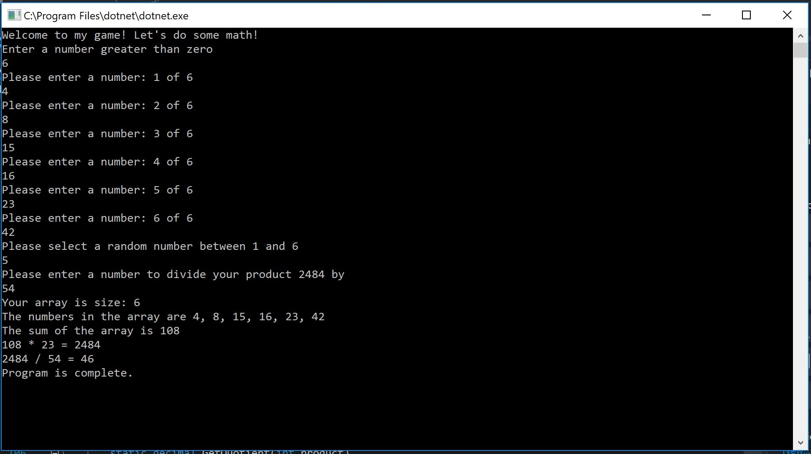

## Lab01-NumbersGame
###Author: Meggan Triplett

####Description
This is a C# console application that will ask a user to enter several numbers and will then take those numbers to run different calculations.

####Getting Started
Clone this repository to your local machine.

$ git clone [https://github.com/Megga-Miister/Lab01-NumbersGame.git]
To run the program from Visual Studio:
Select File -> Open -> Project/Solution

Next navigate to the location you cloned the Repository.

Double click on the Lab01-NumbersGame directory.

Then select and open Lab01NumbersGame.sln

####Visuals

Application Run Through Examples

Change Log
1.1: Added Program.cs files containing working app - 20 March 2019

